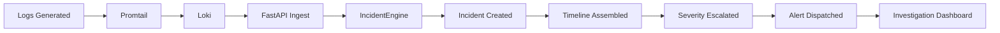

# Security Story: Brute Force → Shell Spawn → Data Exfiltration

## Scenario

An attacker performs a multi-stage attack against the system:

1. **Reconnaissance**: Attacker scans for valid usernames
2. **Brute Force**: Repeated failed login attempts from single IP
3. **Credential Stuffing**: One credential works → account compromised
4. **Lateral Movement**: Shell spawned on backend service
5. **Exfiltration**: Data access and extraction detected

## Logs Generated

```
10:01:15 [auth] level=error message="JWT validation failed" ip=203.0.113.42 userId=user123 traceId=a1b2c3
10:01:16 [auth] level=error message="JWT validation failed" ip=203.0.113.42 userId=user123 traceId=a1b2c4
10:01:17 [auth] level=error message="JWT validation failed" ip=203.0.113.42 userId=user123 traceId=a1b2c5
10:01:18 [auth] level=error message="JWT validation failed" ip=203.0.113.42 userId=user123 traceId=a1b2c6
10:01:19 [auth] level=error message="Invalid credentials" ip=203.0.113.42 userId=user123 traceId=a1b2c7
10:01:20 [auth] level=error message="JWT validation failed" ip=203.0.113.42 userId=user123 traceId=a1b2c8
...
10:01:42 [auth] level=info message="User authenticated successfully" ip=203.0.113.42 userId=user123 traceId=a1b2c9
10:02:01 [backend] level=info message="Request completed in 5ms" endpoint=/api/shell latencyMs=5 traceId=a1b2c10
10:02:15 [worker] level=error message="Suspicious process detected: /tmp/backdoor.sh" traceId=a1b2c11
10:02:30 [worker] level=critical message="Data exfiltration detected: 500MB outbound" traceId=a1b2c12
```

## Correlation Pipeline



## Step-by-Step Correlation

### Step 1: Log Ingestion

```bash
POST /logs/ingest
{
  "logs": [
    {"service": "auth", "level": "error", "message": "JWT validation failed", "ip": "203.0.113.42", ...},
    ...
  ]
}
```

### Step 2: Correlation Rules Triggered

The `IncidentEngine` runs all checks:

| Check | Trigger | Result |
|-------|---------|--------|
| `check_brute_force` | 5+ failed logins from same IP in 5min | ✅ Detected |
| `check_auth_anomaly` | Off-hours auth failure | ⚠️ Suppressed (not off-hours) |
| `check_container_restart` | Container restart pattern | ❌ Not triggered |

### Step 3: Incident Created

```bash
POST /incidents/bbf-203.0.113.42-100142
{
  "id": "bf-203.0.113.42-100142",
  "type": "brute_force",
  "severity": "high",
  "state": "open",
  "message": "Brute force detected: 5 failed login attempts from 203.0.113.42",
  "deduplication_key": "brute_force:auth:203.0.113.42",
  "event_count": 5,
  "confidence_score": 0.8
}
```

### Step 4: Timeline Assembled

```bash
GET /incidents/bf-203.0.113.42-100142/timeline
{
  "timeline": [
    {"sequence": 1, "timestamp": "10:01:15", "service": "auth", "level": "error", "message": "JWT validation failed"},
    {"sequence": 2, "timestamp": "10:01:16", "service": "auth", "level": "error", "message": "JWT validation failed"},
    {"sequence": 3, "timestamp": "10:01:17", "service": "auth", "level": "error", "message": "JWT validation failed"},
    {"sequence": 4, "timestamp": "10:01:18", "service": "auth", "level": "error", "message": "JWT validation failed"},
    {"sequence": 5, "timestamp": "10:01:19", "service": "auth", "level": "error", "message": "Invalid credentials"},
    {"sequence": 6, "timestamp": "10:01:20", "service": "auth", "level": "error", "message": "JWT validation failed"}
  ]
}
```

### Step 5: Severity Escalation

Based on subsequent logs, severity escalates:

- `worker:error` → "Suspicious process detected" → Severity: **HIGH**
- `worker:critical` → "Data exfiltration detected" → Severity: **CRITICAL**

### Step 6: Alert Dispatched

```bash
GET /alerts/security
{
  "alerts": [
    {
      "id": "alert-bf-100142",
      "type": "brute_force",
      "severity": "high",
      "sourceIp": "203.0.113.42",
      "message": "Brute force detected: 5 failed login attempts from 203.0.113.42"
    }
  ]
}
```

### Step 7: Investigation Dashboard

```bash
GET /incidents/bf-203.0.113.42-100142/root-cause
{
  "incident_id": "bf-203.0.113.42-100142",
  "type": "brute_force",
  "summary": "Brute force detected: 5 failed login attempts from 203.0.113.42",
  "initial_event": {
    "timestamp": "10:01:15",
    "service": "auth",
    "message": "JWT validation failed"
  },
  "contributing_factors": [
    "Multiple failed login attempts from IP: 203.0.113.42",
    "Attempt count: 5",
    "Insufficient account lockout policy"
  ],
  "impact_assessment": {
    "account_compromise_risk": "HIGH",
    "lateral_movement_risk": "MEDIUM",
    "data_exposure_risk": "HIGH"
  },
  "recommended_actions": [
    "Block source IP at firewall",
    "Implement account lockout after N attempts",
    "Enable MFA for affected accounts",
    "Review access logs for successful breaches"
  ]
}
```

## Related Logs

```bash
GET /incidents/bf-203.0.113.42-100142/related-logs
{
  "incident_id": "bf-203.0.113.42-100142",
  "related_logs": [
    {"timestamp": "10:01:15", "service": "auth", "level": "error", "message": "JWT validation failed", "ip": "203.0.113.42", "traceId": "a1b2c3"},
    {"timestamp": "10:01:20", "service": "auth", "level": "error", "message": "JWT validation failed", "ip": "203.0.113.42", "traceId": "a1b2c8"},
    {"timestamp": "10:01:42", "service": "auth", "level": "info", "message": "User authenticated successfully", "ip": "203.0.113.42", "traceId": "a1b2c9"},
    {"timestamp": "10:02:15", "service": "worker", "level": "error", "message": "Suspicious process detected", "traceId": "a1b2c11"},
    {"timestamp": "10:02:30", "service": "worker", "level": "critical", "message": "Data exfiltration detected", "traceId": "a1b2c12"}
  ]
}
```

## Incident State Transitions

```
OPEN → INVESTIGATING → MITIGATED → RESOLVED
  ↓
FALSE_POSITIVE (if marked as FP)
```

## Investigation Flow

```
┌─────────────────────────────────────────────────────────────┐
│  1. GET /incidents/{id}       → Initial incident details   │
│  2. GET /incidents/{id}/timeline → Attack progression      │
│  3. GET /incidents/{id}/related-logs → All related events  │
│  4. GET /incidents/{id}/root-cause → Analysis + actions    │
│  5. PATCH /incidents/{id}/state → Update investigation     │
└─────────────────────────────────────────────────────────────┘
```